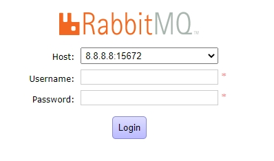
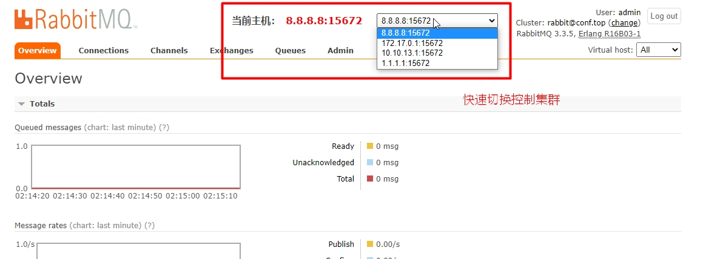

# RabbitMQ Management UI（多集群管理）

RabbitMQ Management UI（多集群管理），基于原版UI界面增加支持多集群控制，不同集群使用相同管理员账号密码下可实现快速切换。

---





---

## 1. 配置Nginx代理 + RabbitMQ UI静态资源
`cat /etc/nginx/vhost/mqm.conf.top.conf`

```
map $request_uri $httpproxy_uri {
    default "/";
    "~^/[^/:]+(:[0-9]{1,5})?(?<httpproxyuri>/.*)" "$httpproxyuri";
}

map $request_uri $httpproxy_host {
    default "";
    "~^/(?<httpproxyhost>[a-z0-9\.-]+)[/|:]?" "$httpproxyhost";
}

map $request_uri $httpproxy_port {
    default "";
    "~^/[^/:]+(?<httpproxyport>:[0-9]{1,5})" "$httpproxyport";
}

server {
        listen              80;

        server_name         mqm.conf.top;            # 域名
 
        charset             utf-8;

        access_log          /data/logs/nginx/mqm.conf.top.access.log main buffer=32k flush=5s;
        error_log           /data/logs/nginx/mqm.conf.top.error.log;

        root                /data/web/rabbitmq-management-ui/; # rabbitmq-management-ui 静态资源目录
        index               index.html;


        # 权限控制(用户名非admin只允许GET)
        access_by_lua_block {
            local request_method = ngx.var.request_method
            local request_uri = ngx.var.request_uri
            local remote_user = ngx.var.remote_user
            local from, to, err = ngx.re.find(request_uri, "/api/", "jo")
            if request_method == 'GET' or not from or not remote_user then
                return
            end
            local u, t, e = ngx.re.find(remote_user, "admin", "jo")
            if u then
                return
            end
            ngx.status = ngx.HTTP_FORBIDDEN
            ngx.header.content_type = 'application/json'
            ngx.say('{"error":"not_authorised","reason":"Access refused."}')
            ngx.exit(ngx.HTTP_FORBIDDEN)
        }

        # 代理后端RabbitMQ
        location ~ '^/[0-9]{1,3}(\.[0-9]{1,3}){1,3}' {
            proxy_set_header    Accept-Encoding  "";
            proxy_set_header    Host    $httpproxy_host;
            #proxy_ssl_server_name on;
            #proxy_headers_hash_bucket_size  128;
            #proxy_headers_hash_max_size     4096;
            #proxy_buffer_size               32k;
            #proxy_buffers                   4 128k;
            #proxy_busy_buffers_size         256k;
            #proxy_max_temp_file_size        256k;
            proxy_pass      http://$httpproxy_host$httpproxy_port$httpproxy_uri;
            #proxy_redirect      ~^(/.*)  $scheme://$host:$server_port/$httpproxy_host$httpproxy_port/$1;
            #proxy_redirect      ~^(http.+) $scheme://$host:$server_port/$1;
        }


        location / {

        }
}
```

## 2. 部署UI资源

```
mkdir -p /data/web/
cd /data/web/
git clone -b v3.6.16 --depth=1 https://github.com/moechs/rabbitmq-management-ui.git
```

## 3. 修改RabbitMQ集群IP，配置文件在`js/host.js`

```
[ root@localhost ]# cat js/host.js 
var hostlist = [
    '8.8.8.8:15672',
    '172.17.0.1:15672',
    '10.10.13.1:15672',
    '1.1.1.1:15672',
];
```

## 4. 启动Nginx测试
